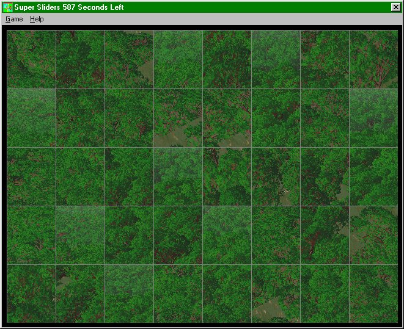



## Super Sliders

### Description

A cool tiles game, load any picture and it will scramble it up, choose the number of tiles and how much it scrambles it up. Also you can set a time limit. Click the tiles to swap them over. Do decrease the size of the download no pictures are supplied. However any picture supported by VB picture box will work. copy your picture to the pics directory to play them. It saves your last used settings. See the screenshot. Send any feedback to TheVBGod@Hotmail.com -- T hope you enjoy the game even if you don't learn anything from it. Thanks, Nick Thompson
 
### More Info
 
Everything is commented so it should be straight foward

             |
---                |---
**Submitted On**   |2001-01-29 20:09:54
**By**             |[Nick Thompson](https://github.com/Planet-Source-Code/PSCIndex/blob/master/ByAuthor/nick-thompson.md)
**Level**          |Intermediate
**User Rating**    |4.4 (22 globes from 5 users)
**Compatibility**  |VB 5\.0
**Category**       |[Games](https://github.com/Planet-Source-Code/PSCIndex/blob/master/ByCategory/games__1-38.md)
**World**          |[Visual Basic](https://github.com/Planet-Source-Code/PSCIndex/blob/master/ByWorld/visual-basic.md)
**Archive File**   |[CODE\_UPLOAD142851292001\.zip](https://github.com/Planet-Source-Code/nick-thompson-super-sliders__1-14778/archive/master.zip)

